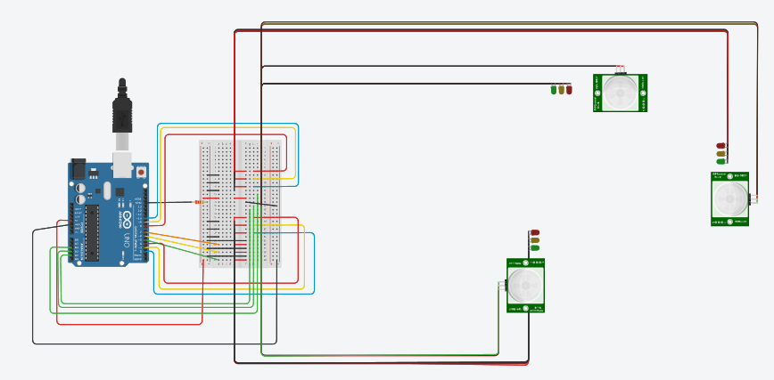

🚦 Semáforos Inteligentes para Mitigação de Tráfego

 

📌 Visão Geral
Sistema de semáforos adaptativos desenvolvido no Tinkercad que utiliza Arduino para controlar dinamicamente os tempos dos sinais de trânsito com base na detecção simulada de veículos.

🔹 Objetivo: Reduzir congestionamentos priorizando vias com maior fluxo
🔹 Destaque: Algoritmo que ajusta tempos em tempo real
🔹 Tecnologias: Arduino, Tinkercad, C++

🎯 Funcionalidades
✅ Controle dinâmico de semáforos

✅ Simulação de sensores de tráfego

✅ Priorização de vias com maior movimento

✅ Fácil adaptação para hardware real

🛠️ Tecnologias Utilizadas
Tecnologia	Descrição
 Arduino	Plataforma de prototipagem eletrônica
 Tinkercad	Ambiente de simulação online
 C++	Linguagem de programação

🚀 Como Executar
bash
# Clone o repositório
git clone https://github.com/EdsonVST/Sem-foro_adaptativo.git
cd semaforos-inteligentes

# Para simulação no Tinkercad:
1. Acesse https://www.tinkercad.com/
2. Crie novo circuito Arduino
3. Copie o código de firmware/semaforo.ino
4. Conecte os sensores de acordo com a imagem disponibilizada. 
5. Execute a simulação

**📄 Licença
MIT © 2024 - [EdsonVST]

